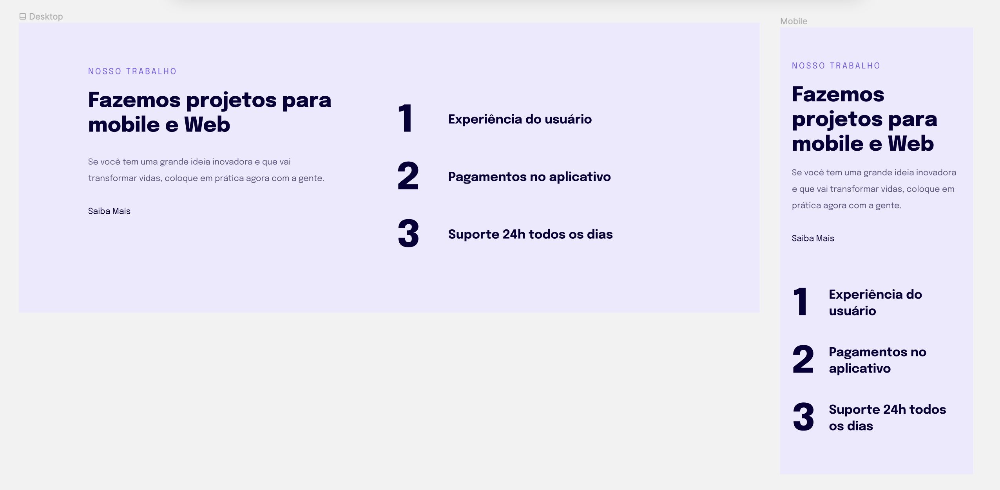
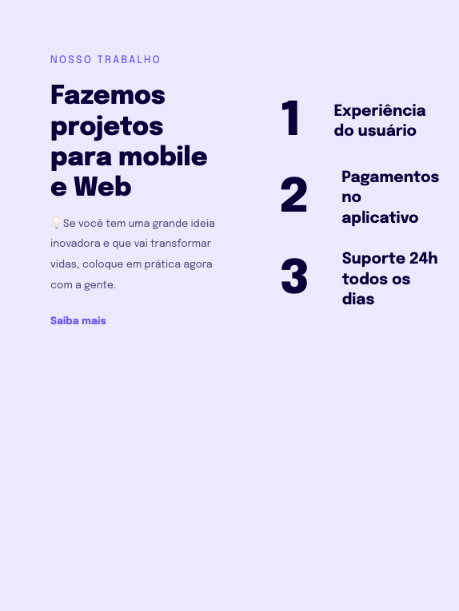
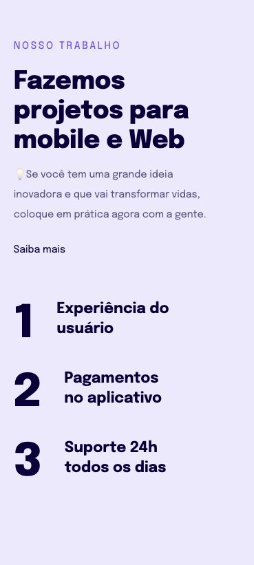
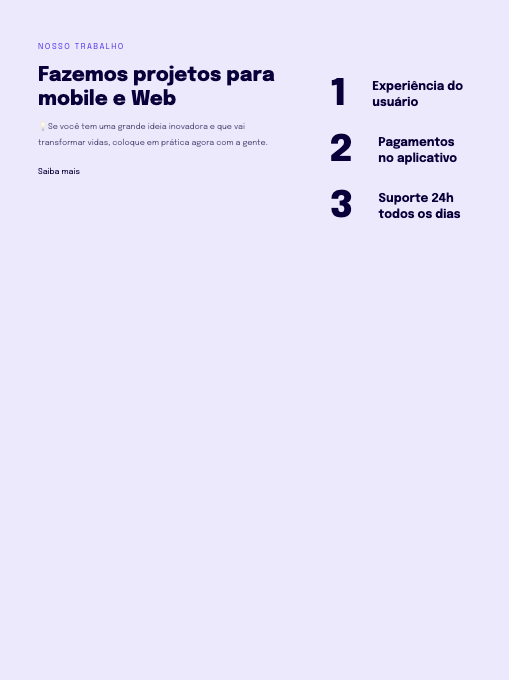

# 🖥 Responsividade em diversos dispositivos
💻 📱 _Responsiveness on multiple devices_

# 🚀 Objetivo:
_Objective:_

🇧🇷 Introducão à responsividade com regra mobile-first, regras das unidades de medidas flexíveis em versão Mobile e Desktop. 

🇺🇸 _Introduction to responsiveness with mobile-first rule, flexible measurement units rules in Mobile and Desktop version._

📸   
 Captura de tela Figma, Desktop e Mobile:
 
 _Figma Screenshot, Desktop and Mobile:_

# ⚙️ Techonogias:
_Technology:_

- [HTML](../index.html)
- [CSS](../css.html)
- [Figma](https://www.figma.com/file/DDFFO0Wh6wpOa0LdwNuR0y/Explorer-Stage-03-Projeto-02/duplicate?node-id=203-412)

# 

# 👩🏻‍💻 Responsividade em alguns dispositivos diferentes:
_Responsiveness on a few different devices:_  

 
📸 Screenshot Desktop:

 
📸 Screenshot iPad Mini:

 
📸 Screenshot iPhone XR:

 
📸 Screenshot Samsung Galaxy S8+:

 
📸 Screenshot Samsung Galaxy S20 Ultra:

 
📸 Screenshot iPad pro:

 

#
## 📝 Projeto:
 _Project:_

🇧🇷 Foi desenvolvido com base nas aulas da Turma 09 Explorer Rocketseat.  

🇺🇸 _Made in Rocketseat's course Explorer._
#
### 🗓 Abril de 2023
 _April 2023_ 
#
 ### 🔗 Link: 
 🇧🇷 [Projeto online aqui!](http://127.0.0.1:5500/index.html#)
   
 🇺🇸 [_Project online here!_](http://127.0.0.1:5500/index.html#)

 #
                    Feito com 🤍 by BM